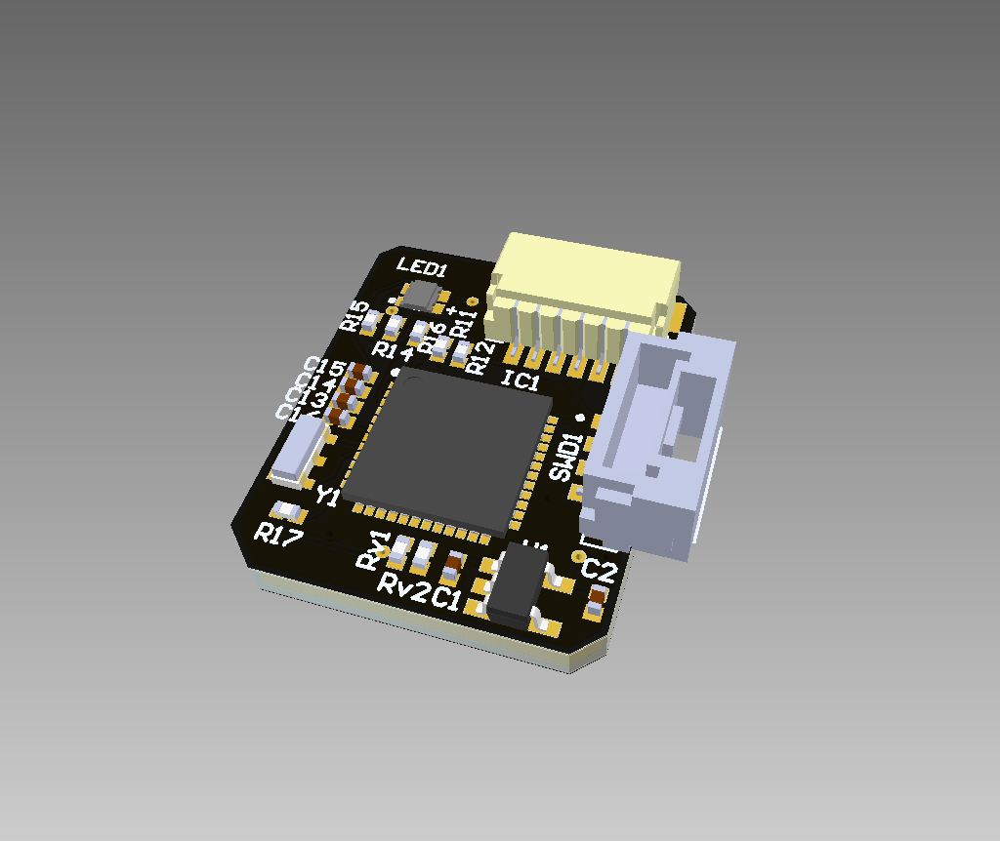
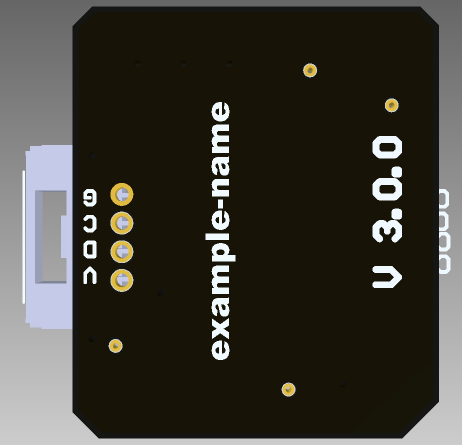
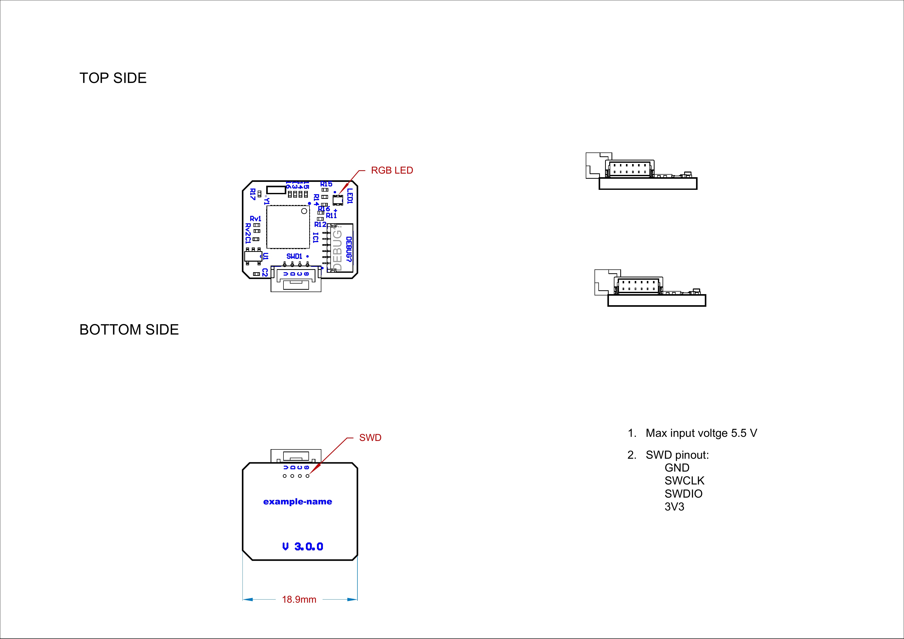

# example-name v3.0.0  

| View | Top | Bottom |
| ---- | --- | ------ |
|  |  |  |

## Mechanical Specification

## MCU PINOUT

| net        | designator | pinNum | pinName | component |
| ---------- | -- | -- | -------------- | -------------- |
| VERSION    | IC1 | 18 | PA7            | STM32G0B1CEU6 |
| SWLK       | IC1 | 36 | PA14-BOOT0     | STM32G0B1CEU6 |
| SWDIO      | IC1 | 35 | PA13           | STM32G0B1CEU6 |
| STM_USB_DP | IC1 | 34 | PA12_[PA10]    | STM32G0B1CEU6 |
| STM_USB_DM | IC1 | 33 | PA11_[PA9]     | STM32G0B1CEU6 |
| STM_NRST   | IC1 | 10 | PF2-NRST       | STM32G0B1CEU6 |
| SDA        | IC1 | 46 | PB7            | STM32G0B1CEU6 |
| SCL        | IC1 | 45 | PB6            | STM32G0B1CEU6 |
| RX         | IC1 | 32 | PA10           | STM32G0B1CEU6 |
| OSC_OUT    | IC1 | 9  | PF1-OSC_OUT    | STM32G0B1CEU6 |
| OSC_IN     | IC1 | 8  | PF0-OSC_IN     | STM32G0B1CEU6 |
| LED_RED    | IC1 | 1  | PC13           | STM32G0B1CEU6 |
| LED_GREEN  | IC1 | 2  | PC14-OSC32_IN  | STM32G0B1CEU6 |
| LED_BLUE   | IC1 | 3  | PC15-OSC32_OUT | STM32G0B1CEU6 |
| GND        | IC1 | 7  | VSS/VSSA       | STM32G0B1CEU6 |
| GND        | IC1 | 49 | VSS            | STM32G0B1CEU6 |
| DEBUG_TX   | IC1 | 41 | PD3            | STM32G0B1CEU6 |
| DEBUG_RX   | IC1 | 40 | PD2            | STM32G0B1CEU6 |
| 3.3        | IC1 | 4  | VBAT           | STM32G0B1CEU6 |
| 3.3        | IC1 | 5  | VREF+          | STM32G0B1CEU6 |
| 3.3        | IC1 | 6  | VDD/VDDA       | STM32G0B1CEU6 |

# Order details 

|       | Width, mm | Length, mm | Height, mm |
| ----- | --------- | ---------- | ---------- |
|Outline|      18.2 |       18.9 |        6.0 |
|PCB    |     15.97 |      18.85 |        2.0 |

- Size (single): 15.97 x 18.85 mm
- Layers: 4 - ['L1', 'L2', 'L3', 'L4']
- Thickness: 2.0
- Min Track/Spacing: 5/5mil (0.127 mm)
- Min Hole Size: 0.25 mm
